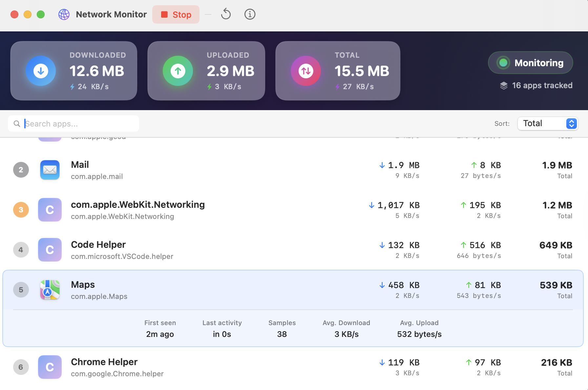

# Network Monitor

<p align="center">
  
</p>

<p align="center">
  <strong>A beautiful, accurate network usage monitor for macOS</strong>
</p>

<p align="center">
  <a href="#-quick-download">Download</a> •
  <a href="#-features">Features</a> •
  <a href="#-installation">Installation</a> •
  <a href="#-how-it-works">How It Works</a> •
  <a href="#-building-from-source">Building</a> •
  <a href="#-contributing">Contributing</a>
</p>

<p align="center">
  <a href="NetworkMonitor.dmg">
    
  </a>
  
  
  
</p>

---

## Quick Download

**[Download NetworkMonitor.dmg](NetworkMonitor.dmg)** (Latest Version)

> **First time opening?** Right-click the app → Select "Open" → Click "Open" in the dialog (required for unsigned apps)

---

## Features

- **Accurate Tracking** - Measures actual network interface bytes (matches your ISP bill)
- **Per-App Breakdown** - See exactly which apps are using your bandwidth
- **Real-Time Rates** - Live download/upload speed monitoring
- **Beautiful UI** - Modern glassmorphism design with smooth animations
- **Search & Sort** - Quickly find apps and sort by various metrics
- **Smart Filtering** - Excludes local traffic, VPN tunnels, and system services
- **Lightweight** - Native Swift app with minimal resource usage

## Installation

### Option 1: Download DMG (Recommended)

1. **[Download NetworkMonitor.dmg](NetworkMonitor.dmg)**
2. Open the DMG file
3. Drag **Network Monitor** to your Applications folder
4. Launch the app

> **Note:** On first launch, right-click the app and select "Open" to bypass Gatekeeper (the app is not notarized).

### Option 2: Build from Source

See [Building from Source](#-building-from-source) below.

## How It Works

Network Monitor uses a hybrid approach for accurate network tracking:

1. **Physical Interface Monitoring** - Reads bytes from `en0` (WiFi/Ethernet) using `netstat`, which matches exactly what your ISP measures
2. **Per-Process Attribution** - Uses `nettop` to get per-process network statistics
3. **Proportional Scaling** - Scales per-app usage to match actual interface bytes, removing TCP overhead and retransmission inflation
4. **Smart Filtering** - Excludes:
   - Local network services (mDNSResponder, Bonjour)
   - Localhost connections (databases, local servers)
   - VPN tunnel processes (prevents double-counting)
   - System services

This approach ensures the total bytes shown match your ISP bill, while still providing accurate per-app breakdowns.

## Building from Source

### Requirements

- macOS 13.0 or later
- Xcode 15+ or Swift 5.9+

### Build Steps

```bash
# Clone the repository
git clone https://github.com/MohammedAlmajhali/NetworkMonitor.git
cd NetworkMonitor

# Build in release mode
swift build -c release

# Run the app
swift run
```

### Create App Bundle

```bash
# Build release
swift build -c release

# Create app bundle structure
mkdir -p "NetworkMonitor.app/Contents/MacOS" "NetworkMonitor.app/Contents/Resources"

# Copy binary
cp .build/release/NetworkMonitor "NetworkMonitor.app/Contents/MacOS/"

# Copy Info.plist (included in repo)
cp Info.plist "NetworkMonitor.app/Contents/"

# Make executable
chmod +x "NetworkMonitor.app/Contents/MacOS/NetworkMonitor"

# Run the app
open NetworkMonitor.app
```

## Project Structure

```
NetworkMonitor/
├── Package.swift           # Swift package manifest
├── Sources/
│   ├── NetworkMonitorApp.swift    # App entry point
│   ├── Models/
│   │   └── DataModels.swift       # Data structures & formatters
│   ├── Services/
│   │   └── NetworkMonitorService.swift  # Core monitoring logic
│   └── Views/
│       ├── ContentView.swift      # Main window & toolbar
│       └── DashboardView.swift    # Dashboard UI components
├── NetworkMonitor.app/     # Built app bundle
└── README.md
```

## Contributing

Contributions are welcome! Here's how you can help:

1. **Fork** the repository
2. **Create** a feature branch (`git checkout -b feature/amazing-feature`)
3. **Commit** your changes (`git commit -m 'Add amazing feature'`)
4. **Push** to the branch (`git push origin feature/amazing-feature`)
5. **Open** a Pull Request

### Ideas for Contributions

- [ ] Menu bar app mode
- [ ] Data export (CSV/JSON)
- [ ] Historical usage graphs
- [ ] Bandwidth alerts/notifications
- [ ] Dark/Light theme toggle
- [ ] Localization support

## Requirements

- **macOS 13.0** (Ventura) or later
- **Architecture:** Apple Silicon (M1/M2/M3) and Intel

## Permissions

Network Monitor uses system utilities (`nettop`, `netstat`) to gather network statistics. These are standard macOS tools that don't require special permissions.

## License

This project is licensed under the MIT License - see the [LICENSE](LICENSE) file for details.

## Acknowledgments

- Built with [SwiftUI](https://developer.apple.com/xcode/swiftui/)
- Inspired by the need for accurate network monitoring that matches ISP billing

---

<p align="center">
  Made with ❤️ for the macOS community
</p>

<p align="center">
  <a href="https://github.com/MohammedAlmajhali/NetworkMonitor/stargazers">⭐ Star this repo</a> if you find it useful!
</p>
